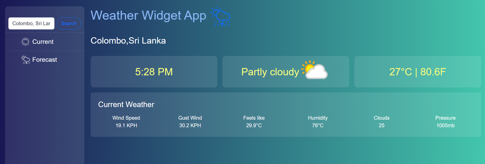
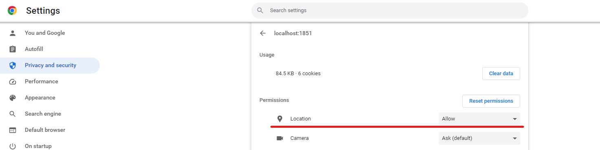

# Weather Forecast App
This project was generated with [Angular CLI](https://github.com/angular/angular-cli) version 13.3.0. I have used [Weatherapi.com](https://www.weatherapi.com/) to retrive the weather data. [Google API](https://developers.google.com/maps) are used to track the current geo location and the cities. This application allows a user to be able to type a location.When you type the city, the textbox suggests the cities. When you choose the city, the application gives weather details.

## Unit tests

Run `ng test` to execute the unit tests via [Karma](https://karma-runner.github.io).

## Built with
- [Angular](https://angular.io/)
- [Bootstrap](https://getbootstrap.com/)
- [Weatherapi.com](https://www.weatherapi.com/)
- [GoogleAPI](https://developers.google.com/apis-explorer)

## Further help

- [Angular](https://angular.io/) is a front-end web framework built by Google. It allows developers to build a single-page applications modeled around a *model-view-controller* (MVC) or *model-view-viewmodel*(MVVM) software architectural pattern. This architecture divides applications into different, but connected parts allowing for parallel development. Following this pattern, Angular splits its different components into the respective parts of a web application. Its components manage the data and logic that pertain to that component, display the data in its respective view, and adapts or controls the view based on the different messages that it receives from the rest of the app.

- [Bootstrap](https://getbootstrap.com/) is a front-end library that helps developers build responsive websites (sites that adapt to different devices), quickly and effectively. It makes use of a grid system that divides each page into twelve columns, which ensures that the page maintains its correct size and scale no matter what device it’s being viewed on.

- [Weatherapi.com](https://www.weatherapi.com/) provides global weather data to users via their API. User can retrieve the latest weather as well as future weather forecasts for any location in the world.

- [GoogleAPI](https://developers.google.com/apis-explorer) The Google APIs Explorer is a tool available on most REST API reference documentation pages that lets you try Google API methods without writing code. The APIs Explorer acts on real data, so use caution when trying methods that create, modify, or delete data. For more details.

## Instructions

Make sure you have an active internet connection.

Application is using google apis to track the Geo locations of the user. Therefore please allow location permission on the browser. When you run the application first-time time browser asks to allow permission for the location. if not, follow the below steps(Chrome)

- Settings
- Privacy and Security
- Site Settings- Allow Location

When you type the city, the textbox suggests the cities. When you choose the city, the application gives weather details.

Weatherapi.com documentation says they provide maximum 10 days forecast for free. But they allow maximum 3 days. Note that as well

## Developer

Anuja Jayathilaka

Familier with following technologies

        

<h3 align="left">Connect with me:</h3>

